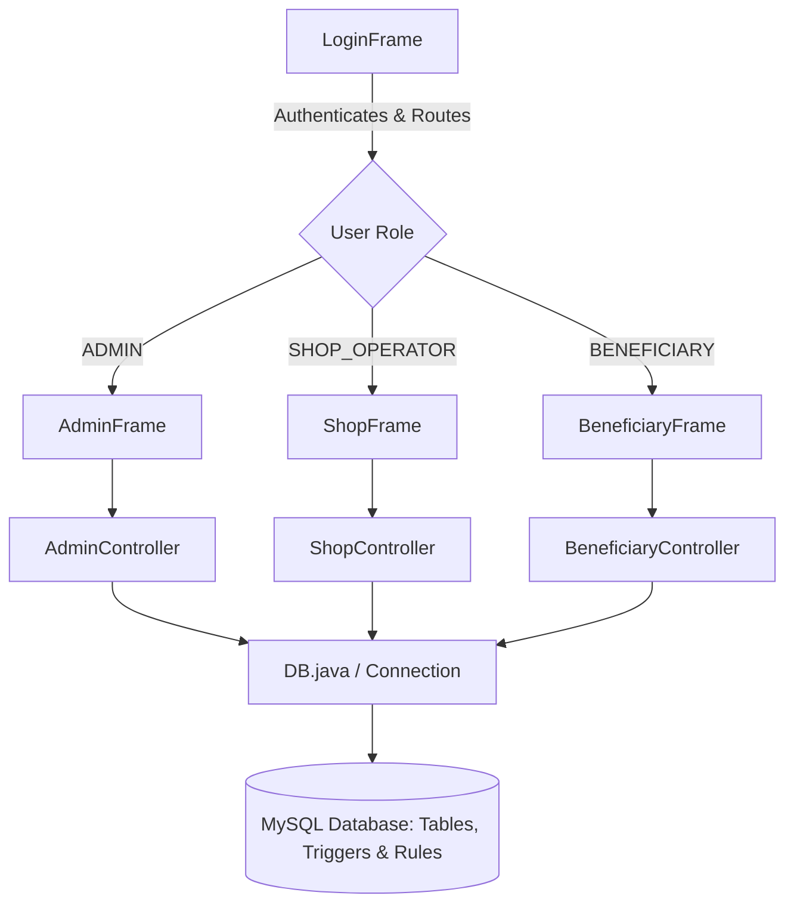

# 🏛️ Public Distribution System (PDS) Portal — Civic Indigo

A modernized, enterprise-grade Java Swing desktop portal representing a nationwide **Public Distribution System** (inspired by platforms like SAP Fiori and Salesforce Lightning). This application demonstrates a clean separation of concerns using a Model-View-Controller (MVC) pattern, robust database-level constraint enforcement, and strict transactional integrity.

---

## 🚀 Key Highlights for Technical Recruiters
* **FlatLaf-Powered Look & Feel**: Beautiful modern material-like UI engine with customized styling properties (anti-aliased curves, subtle hover micro-animations, custom shadows).
* **ACID Transactions**: Strict transaction boundaries managed programmatically using raw JDBC (`autoCommit(false)`, `commit()`, `rollback()`) to ensure header and detail inserts succeed or fail as a single unit.
* **Database-Level Business Integrity**: Critical business rules (such as stock availability verification and automatic inventory deduction) are handled natively via MySQL database triggers.
* **Single-Threaded UI Concurrency**: UI layout modifications are properly marshaled onto Java's single-threaded Event Dispatch Thread (EDT) using `SwingUtilities.invokeLater` to maintain GUI thread safety.

---

## 🛠️ Technology Stack
* **Language**: Java (JDK 21+)
* **UI Framework**: Java Swing
* **Theme Engine**: FlatLaf (v3.5.4 Light & Dark components)
* **Database**: MySQL Server (v8.0+)
* **Driver**: JDBC (MySQL Connector/J v8.3.0)
* **Graphics**: Vector-based rendering with SVG icons support via JSVG

---

## 🏛️ System Architecture

The project implements a clean MVC-like split architecture. Swing components handle the presentation layer, static Java controller classes contain the routing and transaction wrappers, and MySQL handles the persistence layer, constraint checking, and logs.



---

## 📋 Role-Based Feature Matrices

### 👤 Beneficiary Portal
* **Dashboard Overview**: View monthly quota consumption meters, active registration status, and recent request logs.
* **Request Placement**: Order commodities online by choosing tomorrow's scheduled collection slots.
* **Outlet Management**: View registration history and dynamically transfer to another nearby Fair Price Shop.

### 🏪 Shop Operator Portal
* **Inventory Control**: Live stock roster showing item weights and automatic alerts for items falling below low threshold warnings.
* **Distribution Handshake**: View incoming client requests, authorize pickup collections, and trigger automated stock reductions.
* **Restock Supply**: Order wholesale stock directly from connected regional storage warehouses.

### 🔑 System Administrator Portal
* **User Management**: Add, update registration details, modify status, or delete officers and beneficiaries.
* **System Settings**: Set dynamic allocation quotas (APL, BPL, PHH, AAY categories), registers, commodities, and regional storage locations.
* **Audit Trails**: Inspect chronological audit history tracking system-level actions and automated trigger executions.

---

## 🔒 Transactional Integrity & Database Triggers

Data integrity is protected by transactional constraints and MySQL triggers.

### 1. Verification Trigger (`trg_check_stock_before_distribution`)
Fires **BEFORE** an insert on `DISTRIBUTION_TRANSACTION`. It reads the shop's stock, and if the requested amount exceeds the available quantity, blocks execution by throwing a custom SQL signal:
```sql
SIGNAL SQLSTATE '45000'
SET MESSAGE_TEXT = 'Insufficient stock: cannot issue more than available quantity.';
```

### 2. Deduction Trigger (`trg_deduct_stock_after_distribution`)
Fires **AFTER** a transaction insert succeeds. It decrements the available stock count on the `STOCK` table and writes a system-performed action record to the `AUDIT_LOG` table.

### 3. Programmatic JDBC Transactions
When issuing items, [DistributeController.executeDistribution](file:///Users/arnavgarg/Downloads/task5_ui_dbms%202/DistributeController.java) turns off auto-commit:
```java
conn.setAutoCommit(false);
try {
    // Inserts records into DISTRIBUTION_TRANSACTION (triggers check stock)
    // If triggers pass:
    conn.commit(); // Save transaction
} catch (SQLException ex) {
    conn.rollback(); // Undo all modifications on error
} finally {
    conn.setAutoCommit(true);
}
```

---

## 💻 Quick Setup & Run

### Prerequisites
1. **Java JDK 21+** installed and set in your shell environment path.
2. **MySQL Server** running locally on port `3306`.
3. Create a schema named `PDS_DB` and import the table structure along with triggers:
   ```bash
   mysql -u root -p -e "CREATE DATABASE PDS_DB;"
   mysql -u root -p PDS_DB < schema_triggers.sql
   ```

### Compile & Run (macOS / Linux)
```bash
# Make helper scripts executable
chmod +x compile.sh run.sh

# Compile Java classes
./compile.sh

# Run the app (Opens Sign In window)
./run.sh

# Bypass Login for development testing (Opens direct operator dashboard)
./run.sh PDSApp
```

### Compile & Run (Windows)
```cmd
compile.bat
run.bat
run.bat PDSApp
```

---

## 🔑 Demo Access Credentials
You can use the default demo credentials to explore the roles:

| Role | Username | Password |
| :--- | :--- | :--- |
| **System Administrator** | `admin` | `admin123` |
| **Shop Operator** | `shop101` | `shop101` |
| **Beneficiary** | `ben1` | `pass123` |

To reset or seed 100 random beneficiaries, run:
```bash
java -cp "lib/*:." PopulateBeneficiaries
```
